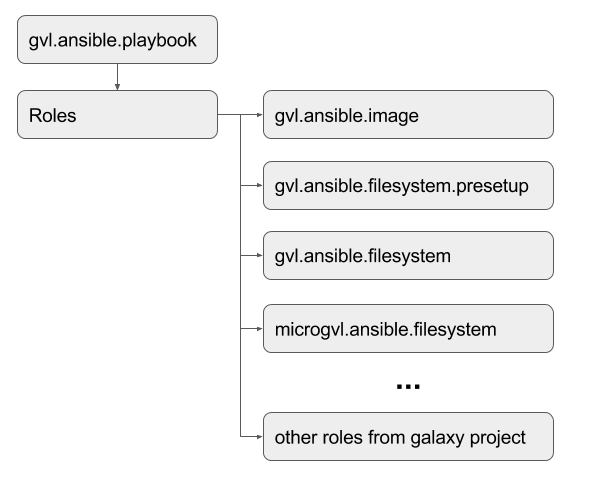

# microgvl.ansible.filesystem

This is the ansible playbook for the **Microbial Genomics Virtual Laboratory (mGVL)** filesystems. It is an extension of the normal GVL filesystem ansible script. It is located at [https://github.com/gvlproject/microgvl.ansible.filesystem](https://github.com/gvlproject/microgvl.ansible.filesystem)

This role creates two filesystem objects for later use with the GVL launch system (one automatically, second one manually.)

1. The mGVL galaxy filesystem object - **microgvl-fs-< version## >.tar.gz**
  * Contains Galaxy, all of the installed Galaxy tools, the poststart.d script directory and the ftp upload store.
2. The mGVL application filesystem object - **microgvl-apps-< version## >.tar.gz**
  * Contains installations of all of commandline tools for the mGVL.
  * Contains the linuxbrew installations and linuxbrew itself.

These two tarballs are then used by the GVL launcher to instantiate new mGVL instances.

## Usage/Building the mGVL

To use the role you need to clone the gvl.ansible.playbook script ([https://github.com/gvlproject/gvl.ansible.playbook](https://github.com/gvlproject/gvl.ansible.playbook)) and follow the instructions in it's readme to download and install the dependencies (mostly extra roles including this one.)

Then to run the build process:

  1. Start a cloud machine of the GVL base image using the cloud dashboard launch functionality (this describes the OpenStack cloud dashboard, it will be slightly different for other cloud types):
    * On the *Details* tab, give it a sensible name, select at least a medium machine size (2vpus), use the *GVL 4.0.0* image.
    * On the Access and Security tab: select *cloudman_key_pair* (or a known key pair), *Cloudman* security group.
    * On the Post Creation tab: Select *Direct Input* and put `no_start = True` in the script input box.
    * Click the *Launch* button.
    * Once it starts, record the ip address of the newly created machine.
  2. Create the inventory file.
    * Copy the `inventory/builders.sample` file to `inventory/builders`.
    * Edit the `inventory/builders` and replace *< instance-ip >* under `[gvl-filesystem-hosts]` with the ip address of the machine you created in step 1.
  3. Edit `roles/microgvl.ansible.filesystem/default/main.yml` and add your cloud credentials to the appropriate variables.
  4. From the gvl.ansible.playbook directory, run the playbook! (Preferably from a screen)

  ```
  ansible-playbook -i inventory/builders playbook.yml --tags "mgvl-fs" --extra-vars psql_galaxyftp_password=<choose a password> --extra-vars vnc_password=<choose a password> --extra-vars cleanup=no
  ```

  but I would suggest running it using linux's script command with tee to capture the verbose (-vvv flag in the command line) ansible output into a logfile thus:

  ```
script -q -c "ansible-playbook -vvv -i inventory/builders playbook.yml --tags "mgvl-fs" --extra-vars psql_galaxyftp_password=<choose a password> --extra-vars vnc_password=<choose a password> --extra-vars cleanup=no" /dev/null | tee ansible-build-logfile.log
  ```

  5. The filesystem object called `microgvl-fs-< version## >.tar.gz` will have been uploaded to the cloud object store in the container specified in the `cloudman_bucket_name:` variable in `roles/microgvl.ansible.filesystem/default/main.yml`.

  6. At this stage, the microgvl-apps-{{ gvl_fs_version }}.tar.gz archive is not created or uploaded to the object store by the script and both things must be done manually.
    * ssh into the build target instance as ubuntu
    * Create a tarball of the /mnt/gvl directory by:
    ```
    $ cd /mnt/gvl
    $ sudo tar -zcf /mnt/galaxy_archive/microgvl-apps-< version## >.tar.gz .
    ```
    * Upload the resulting tarball into the same cloud object store container as the filesystem object.

## Role design

This playbook has been designed as a role under the **gvl.ansible.playbook**. Located at: https://github.com/gvlproject/gvl.ansible.playbook.

The exact relationship between the scripts is shown in the figure below.

*Figure 1: Relationship between gvl playbook and associated ansible roles*



The **microgvl.ansible.filesystem** role extends the **gvl.ansible.filesystem** role. It overrides several variables and adds some extra tasks.

The layout of the role is as follows:

* **microgvl.ansible.filesystem**

  * **defaults**

    * *main.yml* - file contains the global variables for the script. Also overrides several variables located in the corresponding location of the *gvl.ansible.filesystem* script.

  * **files**

    * *galaxy-app* - contains the overridden *welcome.html* file for the greeting page of Galaxy. (Overrides *gvl.ansible.filesystem*)

    * *scripts* - contains *shed_tool_list.yaml.mgvl* - list of tools to be installed into Galaxy.

    * *system-ansible.yml* - This script is to change the base image partition (root partition) post launch. It installs system packages, adds some directories and installs some extra R libraries. This is necessary as there is no way to alter the root partition of the base gvl image at filesystem build time.

  * **meta**

    * *main.yml* - Contains some meta data about the role including its dependencies, license etc.

  * **tasks** - the set of yaml files that are executed by ansible during the build process for this role.

    * *main.yml* - runs the micro_gvl_cmd_apps.yml script and then finally creates the fs acrhive.

    * *micro_gvl_cmd_apps.yml* - creates some directory structure and then runs the installation yml files.

    * *install_linuxbrew.yml* - Installs base linuxbrew and some of the required brew packages.

    * *install_nullarbor.yml* - Installs T. Seemann's nullarbor pipeline and associated packages via linuxbrew and perl cpanm. It also downloads and sets up the kraken microbial identifier database.

    * *install_visualisers.yml* - Installs various genomics visualiser software such as Mauve, IGV, Artemis and Bandage.

    * *install_other_brew_tools.yml* - Installs other stand alone tools, mostly via brew. It adds some to the linuxbrew python via pip. It also installs a few R libraries to the system R.

  * **templates**

    * *copy_modules.j2* - template that creates a script to move various pathing files to */etc/profile.d* and to run the *system-ansible.yml* script. This script is run postlaunch of the individual instances and modifies the underlying system root partition to accommodate the changes necessary for the microbial GVL.

    * *linuxbrew-path.j2* - template for the linuxbrew environment paths to be copied into */etc/profile.d* of the instantiated microgvl.

    * *linuxbrew.j2* - template for the linuxbrew environment module for use on cloudman clusters.

    * *visualiser-paths.j2* - template for the environment paths for the installed visualiser software.
